# Homework-1 README

## **Basic Tasks**

### **Homework 1.1 - Rendering a Single Circle**

This assignment involves rendering a single circle on a canvas using the provided `balboa` codebase. The objective is to determine the color of each pixel based on whether the pixel center falls inside or outside the circle.

**1. Implementation Details**
- The implementation for this task is located in `hw1.cpp` under the function `void hw_1_1(const std::vector<std::string> &params)`.
- The canvas is 640 × 480 pixels.
- The circle's center, radius, and color can be specified via parameters:
  - `-center x y`: Center coordinates of the circle
  - `-radius r`: Radius of the circle
  - `-color r g b`: RGB color of the circle
- Pixels inside the circle are assigned the specified color; others are assigned a gray background.

**2. Usage**
- To render a circle, run commands such as:

```bash
./balboa -hw 1 1 -center -50 250 -radius 100 -color 0.7 0.3 0.3
./balboa -hw 1 1 -center 600 250 -radius 150 -color 0.3 0.5 0.7
./balboa -hw 1 1 -center 250 470 -radius 50 -color 0.7 0.5 0.7
```

**3. Output**
The rendered images can be viewed in: 
- `outputs/hw_1_1_1.png`
- `outputs/hw_1_1_2.png`
- `outputs/hw_1_1_3.png`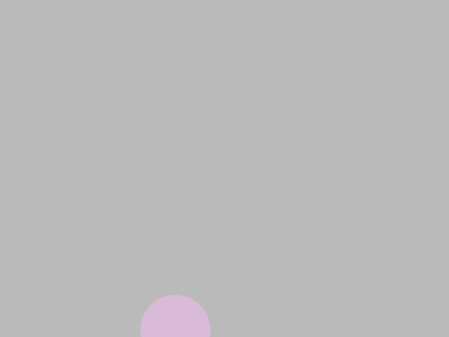

---

### **Homework 1.2 - Rendering Multiple Circles**

This assignment involves rendering multiple overlapping circles on a canvas. The objective is to correctly determine the color of each pixel based on whether the pixel center falls inside one or more circles and resolve overlapping regions to display the closest circle.

**1. Implementation Details**
- The implementation for this task is located in `hw1.cpp` under the function `Image3 hw_1_2(const std::vector<std::string> &params)`.
- The canvas dimensions, background color, and circle properties (center, radius, color) are specified by the selected scene from the `hw1_2_scenes` array in `hw1_scenes.h`.
**2. Loop Structure**
This implementation uses a **circle-first loop structure**:
- For each circle, iterate over all pixels to check for overlaps and update pixel colors accordingly.
- This approach effectively layers the circles, with the last one in the array rendered on top.

Alternatively, a **pixel-first loop structure** could be used:
- For each pixel, iterate over all circles to determine the closest overlapping circle.
- This method resembles ray tracing and would ensure the closest circle determines the pixel color.

**3. Usage**
- To render scenes, use the following command format:

```bash
./balboa -hw 1_2_[scene_id]
```
- Replace `[scene_id]` with the desired scene index (0-4).

**4. Output**
- The resulting images for scenes 1-4 can be viewed in :
    - `outputs/hw_1_2_1.png`
    - `outputs/hw_1_2_2.png`
    - `outputs/hw_1_2_3.png`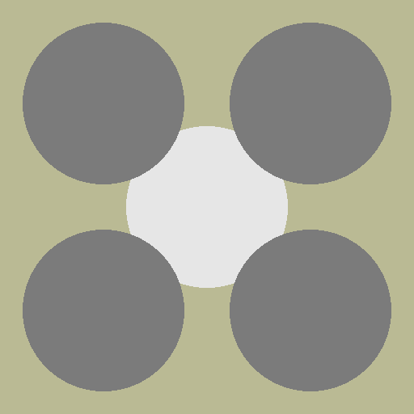
    - `outputs/hw_1_2_4.png`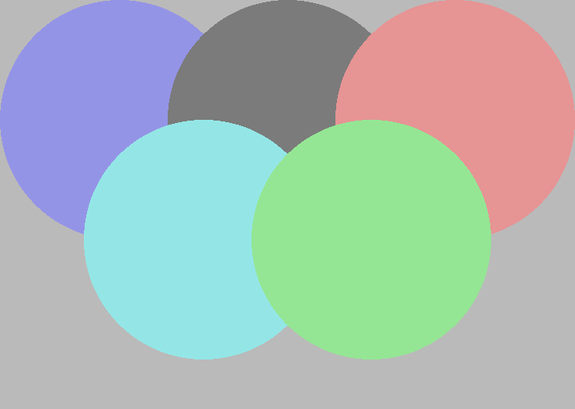

---

### **Homework 1.3 - Rendering Multiple Shapes**
This assignment extends our rendering engine to support multiple shapes, including circles, rectangles, and triangles, using a JSON-based scene description. The objective is to parse the scene file, determine the color of each pixel based on whether it falls inside the shapes, and render the result.

**1. Implementation Details**
- The implementation is located in `hw1.cpp` under the function `Image3 hw_1_3(const std::vector<std::string> &params)`.
- The scene is provided as a `JSON` file and parsed into a `Scene` structure, which contains:
  - `resolution`: Canvas resolution (width × height).
  - `background`: Background color.
  - `shapes`: A list of shapes (circles, rectangles, and triangles).
- Each shape is represented as a variant.
- Key Functions:
  - **Circle Rendering**: Each pixel's distance from the circle center is compared to the radius.
  - **Rectangle Rendering**: The pixel coordinates are checked against the bounds of the rectangle.
  - **Triangle Rendering**: A helper function `IsPointInsideTriangle` determines whether a pixel is inside the triangle using cross-product tests.

**2. Usage**
- To render scenes, use the following commands:

```bash
./balboa -hw 1_3 ../scenes/hw1/three_shapes_2.json
./balboa -hw 1_3 ../scenes/hw1/cat.json
./balboa -hw 1_3 ../scenes/hw1/robot.json
```

**3. Output**
- The rendered images can be viewed in :
    - `outputs/hw_1_3_three_shapes_2.png`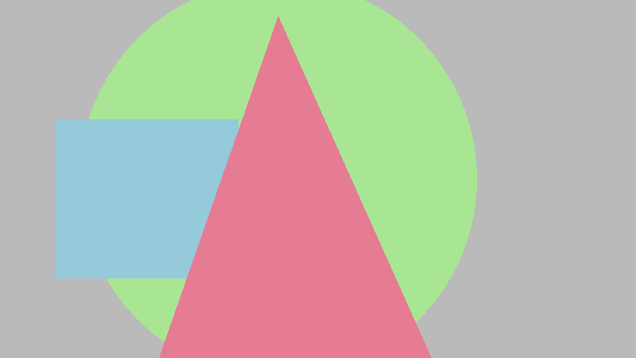
    - `outputs/hw_1_3_cat.png`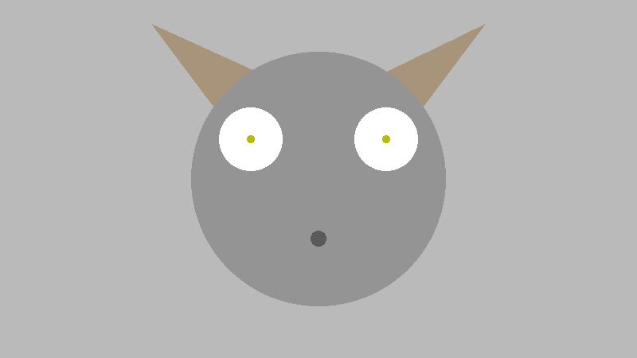
    - `outputs/hw_1_3_robot.png`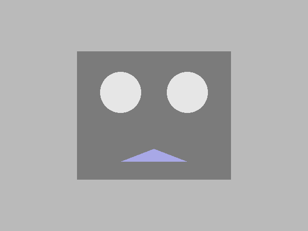


---
### **Homework 1.4 - Rendering Transformed Shapes**

In this assignment, we extend our rendering engine to support **2D affine transformations** applied to geometric shapes. These transformations include scaling, rotation, shearing, and translation, as well as their combinations. By applying these transformations, we can manipulate shapes to produce more complex renderings and animations.

**1. Key Challenges**

1. **Combining Transformations**: The order of transformations matters (e.g., scaling after rotation is not the same as rotation after scaling).
2. **Pixel Hit Testing**: After transformations, a shape may not remain easy to test in screen space. Instead, we convert screen space pixels back to object space using the **inverse transformation matrix**, then test the shape in object space.

---

**2. Implementation Details**

- `parse_transformation` Function in `hw1_scenes.cpp`, this function parses the sequence of transformations from the JSON scene file and combines them into a single (3*3) matrix. Each transformation is applied in order and multiplied into the matrix.

Supported transformations:
- **Scale**:
  ```cpp
  Matrix3x3 m1 = Matrix3x3::identity();
  m1(0, 0) = scale.x;
  m1(1, 1) = scale.y;
  F = m1 * F;
- **Rotate**:
  ```cpp
  double radians = angle * M_PI / 180.0;
  Matrix3x3 m2 = Matrix3x3::identity();
  m2(0, 0) = cos(radians);
  m2(0, 1) = -sin(radians);
  m2(1, 0) = sin(radians);
  m2(1, 1) = cos(radians);
  F = m2 * F;
- **Translate**:
  ```cpp  
  Matrix3x3 m3 = Matrix3x3::identity();
  m3(0, 2) = translate.x;
  m3(1, 2) = translate.y;
  F = m3 * F;
- **Shear**:
  ```cpp  
  Matrix3x3 m4 = Matrix3x3::identity();
  m4(0, 1) = shear_x; // Shear X
  m4(1, 0) = shear_y; // Shear Y 
  F = m4 * F;

- `Image3 hw_1_4(const std::vector<std::string> &params)` in `hw1.cpp`, this function renders the transformed shapes. For each pixel:
  - Compute its center in screen space.
  - Convert the screen space point to object space using the inverse transformation matrix.
  - Test whether the object space point is inside the original shape.

**3. Usage**
- To render scenes, use the following commands:

```bash
./balboa -hw 1_4 ../scenes/hw1/transformation_2.json
./balboa -hw 1_4 ../scenes/hw1/sun.json
./balboa -hw 1_4 ../scenes/hw1/piggy.json
```

**4. Output**
- The rendered images can be viewed in :
    - `outputs/hw_1_4_transformation_2.png`
    - `outputs/hw_1_4_sun.png`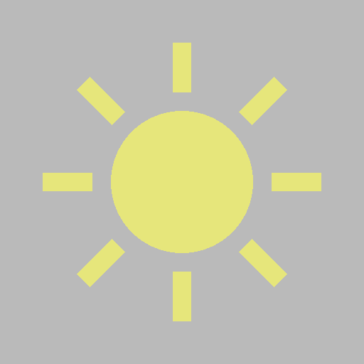
    - `outputs/hw_1_4_piggy.png`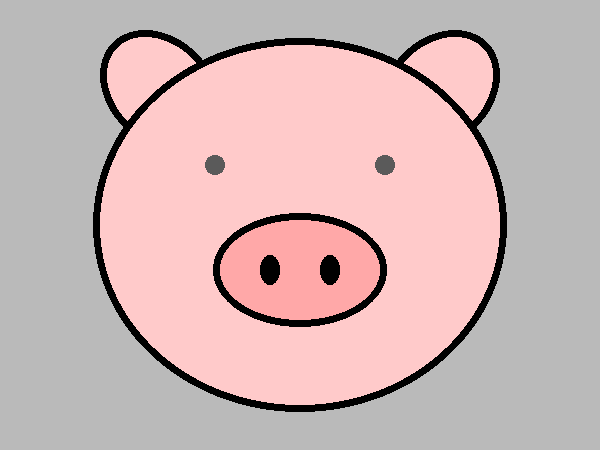

---

### **Homework 1.5 - Antialiasing**

This assignment focuses on implementing the simplest form of antialiasing called supersampling. The objective is to reduce the jagged edges (aliasing) around object boundaries by sampling multiple points within a pixel and averaging the results. Specifically, a 4x4 supersampling pattern is used, where each pixel is subdivided into 16 subpixels, and the color at the center of each subpixel is computed and averaged.
**1. Implementation Details**
- The implementation for this task is located in `hw1.cpp` under the function `Image3 hw_1_5(const std::vector<std::string> &params)`.
- The canvas is rendered based on the resolution defined in the scene file.
- The program uses the supersampling technique to compute the color for each pixel by dividing each pixel into a 4x4 grid and averaging the colors of the subpixels.

**2. Antialiasing Process**
- For each pixel, the algorithm tests 16 subpixels (4x4 grid) by calculating the color for each subpixel based on its position and shape intersections (Circle, Rectangle, or Triangle).
- After evaluating the color for each subpixel, the average color of the subpixels is assigned to the corresponding pixel.

**3. Usage**
- To test the antialiasing implementation, run the following command:
```bash
./balboa -hw 1_5 ../scenes/hw1/transformation_2.json
./balboa -hw 1_5 ../scenes/hw1/sun.json
./balboa -hw 1_5 ../scenes/hw1/piggy.json
```
**4. Output**
- The rendered images can be viewed in :
    - `outputs/hw_1_5_transformation_2.png`
    - `outputs/hw_1_5_sun.png`
    - `outputs/hw_1_5_piggy.png`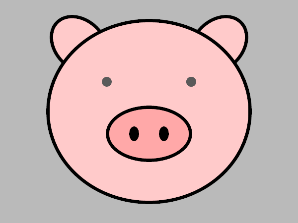
---


### **Homework 1.6 - Alpha Blending**

This assignment involves adding transparency to objects in the scene. Each object now has an alpha value in addition to its RGB color. The alpha value determines the transparency of the object:

- A value of `α = 0` means the object is fully transparent (invisible), A value of `α = 1` means the object is fully opaque (same as previous assignments),
- Values between 0 and 1 represent partial transparency, requiring the blending of the object's color with the background or other objects in front.
The goal of this task is to implement the alpha blending formula to handle multiple objects with transparency, as described by the following equations:

- For a single object with color `C_o` and alpha `α_o`, blended with the background color `B`: `C = α_o * C_o + (1 - α_o) * B`
- For two objects, with colors `C_o` and `C_1`, and alpha values `α_o` and `α_1`, where object `O` is in front of object `1`, the blending is: `C = α_o * C_o + α_1 * (1 - α_o) * C_1 + (1 - α_o) * (1 - α_1) * B`

**1. Implementation Details**

- The implementation for this task is located in `hw1.cpp` under the function `Image3 hw_1_6(const std::vector<std::string> &params)`.
- The resolution of the canvas is defined by the scene's `resolution.x` and `resolution.y`.
- Each object in the scene (circle, rectangle, triangle) now has an associated alpha value (`alpha`).
- The final color for each pixel is calculated by blending the color of objects with the background color, taking into account their transparency.

**2. Usage**
- To render scenes, use the following commands:

```bash
./balboa -hw 1_6 ../scenes/hw1/alpha_2.json
./balboa -hw 1_6 ../scenes/hw1/alpha_circles.json
./balboa -hw 1_6 ../scenes/hw1/alpha_triangles.json
```
**3. Output**
- The rendered images can be viewed in :
    - `outputs/hw_1_6_alpha_2.png`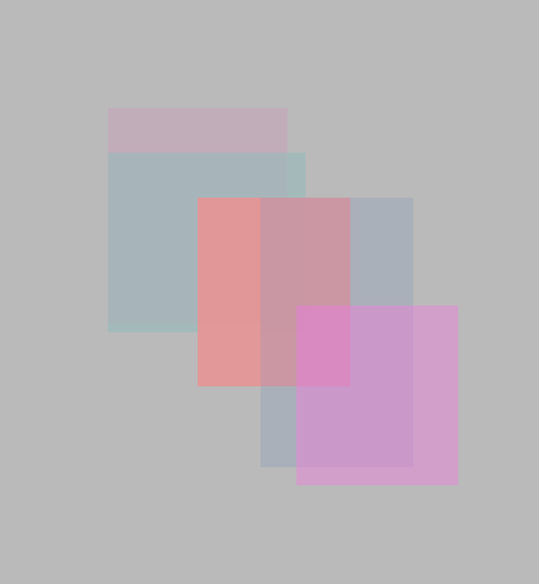
    - `outputs/hw_1_6_alpha_circles.png`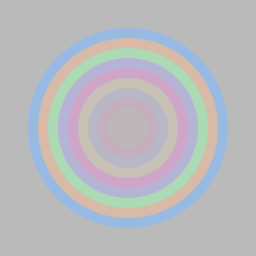
    - `outputs/hw_1_6_alpha_triangles.png`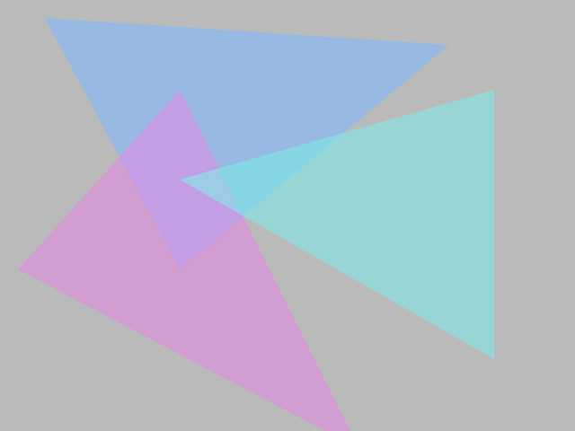
---

***

## Bonus Challenges

### Homework 3.3 Bonus--"Camera Rotation Based on Mouse"

### Homework 1.7 -- Design My Own Scene

For homework 1.7, I designed scenes located in "homework_1_7/miffy.json".
- My rendering of the scene can be found at "homework_1_7/hw_1_7_miffy.png". 
- You can use `./balboa -hw 1_5 ../scenes/hw1/miffy.json` to generate the rendering

### Homework 1.2 Bonus--"Accelerating Rasterization Using Bounding Boxes"

Regarding homework 1.2's "Bonus: accelerating rasterization using bounding boxes,"
- My original code was as follows: 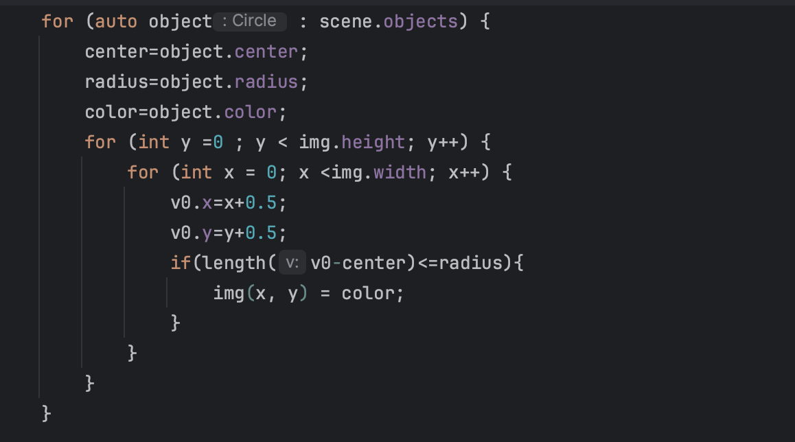
  - Its runtime was as follows: 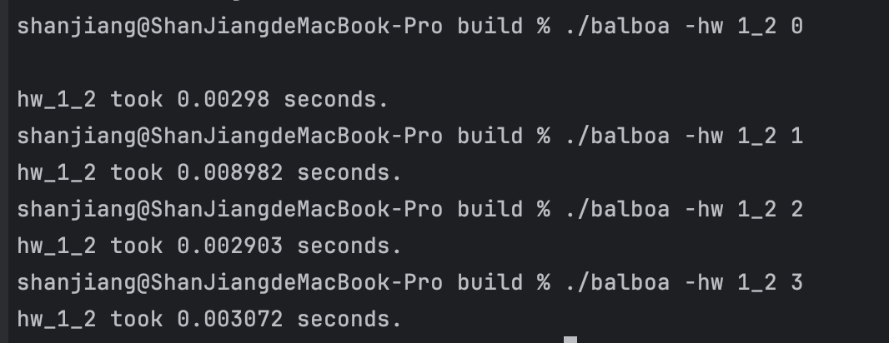

- After implementing bounding boxes, I improved the code as follows: 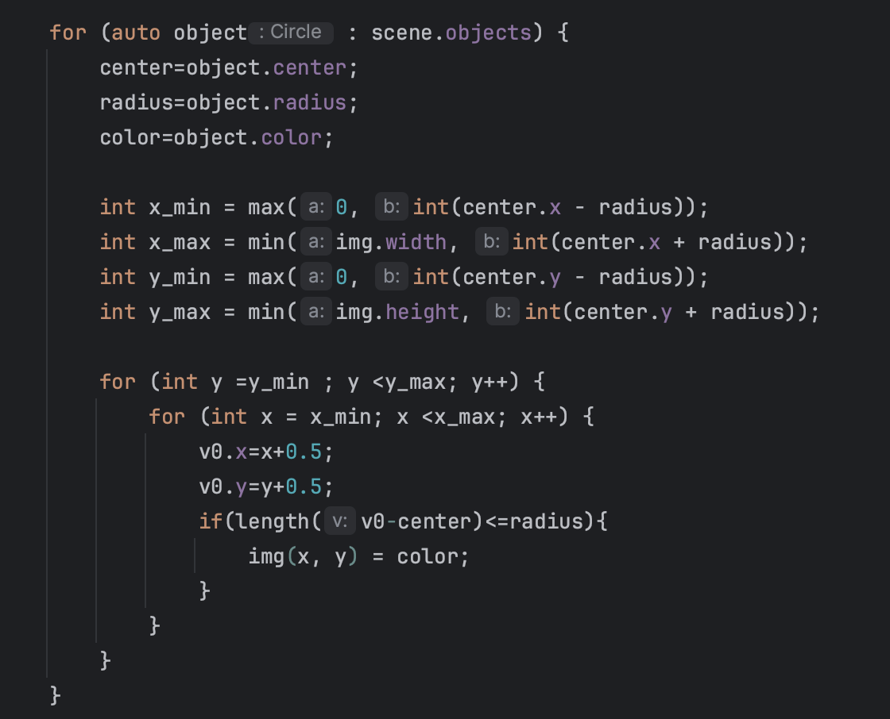
  - [Improved Code with Bounding Boxes](code/src/hw1.cpp)
  - Its runtime has been reduced to the following: 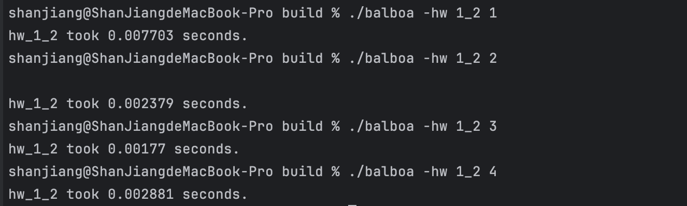
- From the before-and-after comparison, it is evident that using bounding boxes to accelerate the rasterization process can yield a significant performance boost of several times.

### Homework 1.8 Bonus--"Line and Bézier Curve Rendering"

For homework 1.8's "Bonus: line and Bézier curve rendering (15 pts)," 
- I made modifications to the code in `src/hw1.cpp`,`src/hw1.h`,`src/hw1_scenes.cpp`,`src/hw1_scenes.h` and `src/main.cpp` to enable the function `Image3 hw_1_8(const std::vector<std::string> &params);`. 
- I created a scene located at `homework_1_8/line.json`, and the generated image can be found at "homework_1_8/hw_1_8.png". 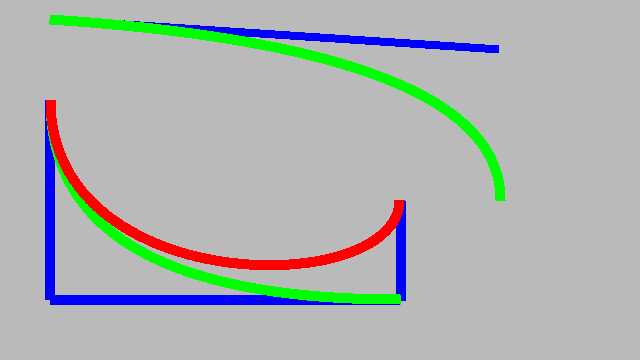
- You can use `./balboa -hw 1_8 ../scenes/hw1/line.json` to generate the rendering.

