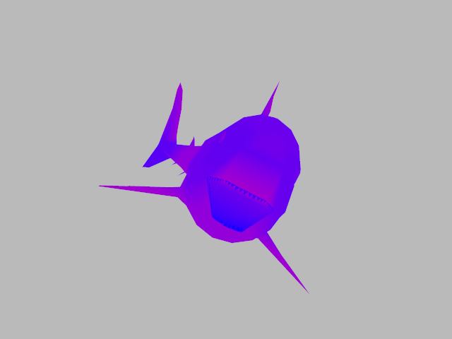
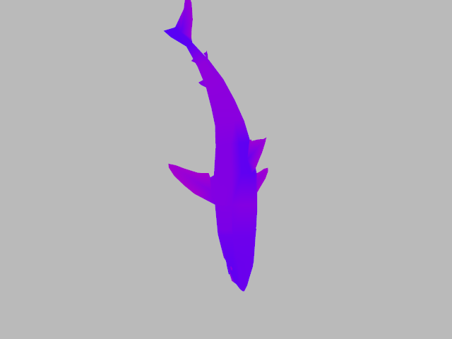
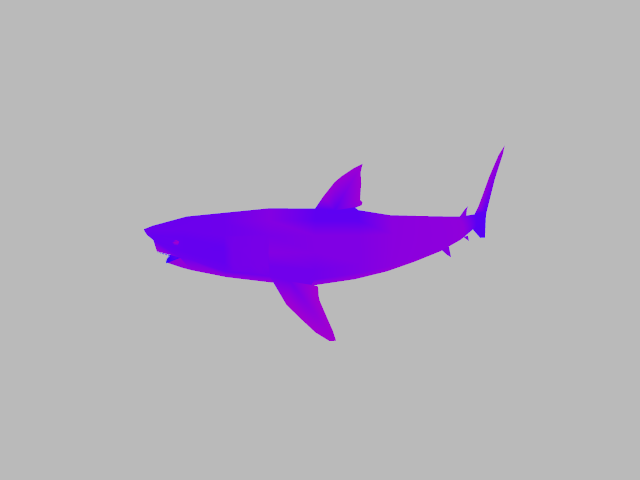
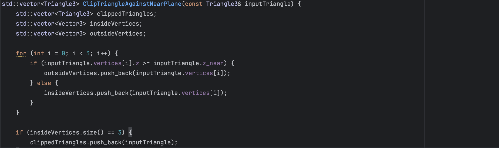
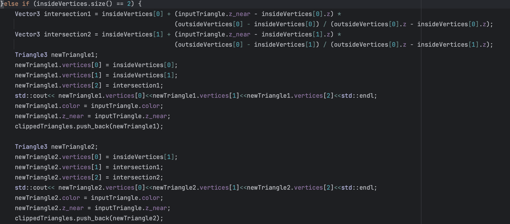
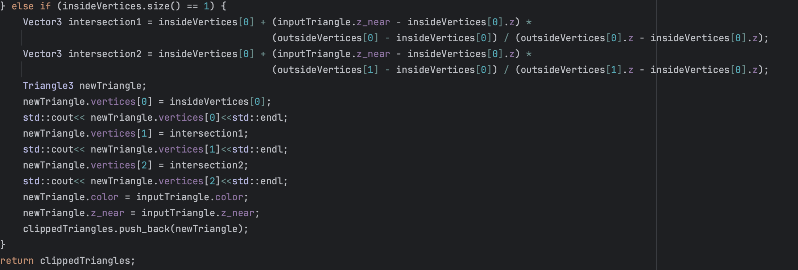
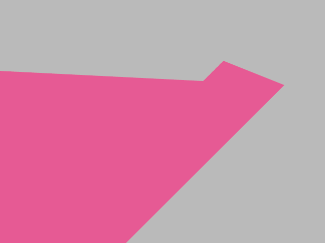

# Homework Submission README

## Homework 2.5

1. For homework 2.5, I designed scenes located in "hw_2_5/shark1.json" as the front view, "hw_2_5/shark2.json" as
   the top view, "hw_2_5/shark3.json" as the side view.
   The 3D model "shark.ply" is downloaded from "https://people.sc.fsu.edu/~jburkardt/data/ply/ply.html"
    - My renderings of the scenes can be found at "hw_2_5/hw_2_5_front.png", 
      "hw_2_5/hw_2_5_top.png", "hw_2_5/hw_2_5_side.png",
    - You can use "./balboa -hw 2_4 ../scenes/hw2/shark1.json", "./balboa -hw 2_4 ../scenes/hw2/shark2.json", 
   "./balboa -hw 2_4 ../scenes/hw2/shark3.json" to generate the rendering

## Homework 2.1 Bonus

1. Regarding homework 2.1's "Bonus: triangle clipping (15 pts)"
   The code you can find at the function "vector<Triangle3> ClipTriangleAgainstNearPlane(const Triangle3& inputTriangle)" in "code/src/hw2.cpp".
   The code is "bonus_2_1/clip1.png","bonus_2_1/clip2.png",
   "bonus_2_1/clip3.png",
   
   - If one vertex of a triangle is behind th near clipping plane:
     I use "./balboa -hw 2_1 -s 1 -p0 2 2 -4 -p1 1 0.3 -1 -p2 -2 -2 6 -color 0.8 0.1 0.3 -znear 1e-6" and generate the scene at 
   - If two vertices of a triangle are behind th near clipping plane:
     I use "./balboa -hw 2_1 -s 1 -p0 2 2 4 -p1 1 0.3 1 -p2 -2 -2 -6 -color 0.8 0.1 0.3 -znear 1e-6" and generate the scene at 
   

## Homework 2.4 Bonus

1. For homework 2.4's "Bonus: generate an animation by interpolating between transformations(15 pts),"
    - I use ffmpeg to convert a sequence of images of the teapot (Rotate around the up axis, generate one image every 10 degrees of rotation, for a total of 360 degrees).
    - The video file you can find in "bonus_2_4/output.mp4",

## Homework 2.2 Bonus

1. I didn't really implement this bonus, but I study that the idea is to create a MipMap for this image. Taking a 1024x1024 image as an example, 
   MipMap-level 0 is the image itself. Level 1 combines every 4 pixels into one larger pixel, resulting in a lower-resolution 512x512 image. 
   Level 2 continues this 4-to-1 operation based on the 512x512 image, and so on. When combining pixels, it is evident that in the HZBOC (Hierarchical Z-Buffer Occlusion Culling),
   the depth of the four pixels with the highest depth value (the farthest from the viewpoint) is taken as the merged value. 
   Assuming our Z-buffer has 4 levels, for the triangles that are about to be rendered, we first calculate their bounding box and take the depth value of the vertex with the smallest depth as the "depth."
   Now, we determine a Mipmap Level, and the method to do so is to make the Mipmap level's pixel size as large as possible (the Mipmap level is as high as possible) 
   while still meeting the following condition: the long edge of the bounding box must span at least two pixels. Iterate through each pixel inside this bounding box, find the maximum depth value, 
   and if it is smaller than "depth," then the object is culled, and no further rendering is required. Otherwise, reduce the level and repeat the above test until the lowest level, level 0. 
   If it still exceeds "depth," then the triangle needs to be rendered.