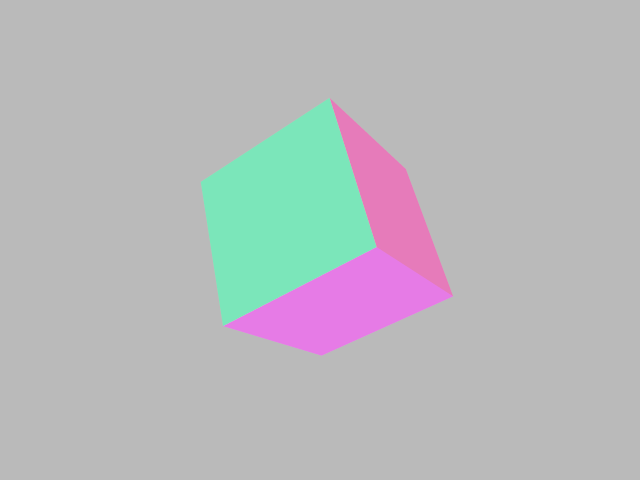
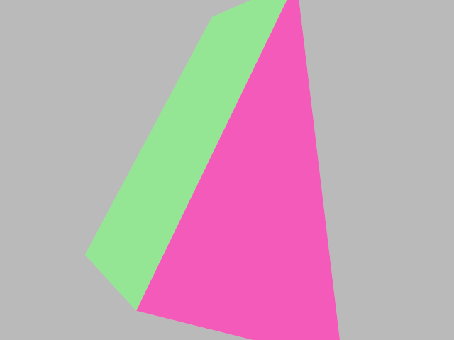
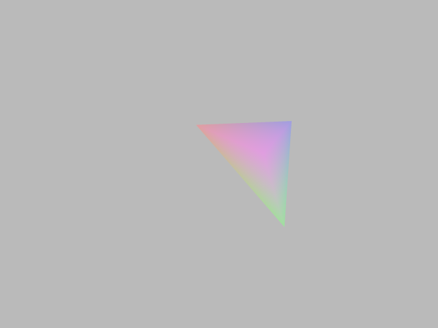
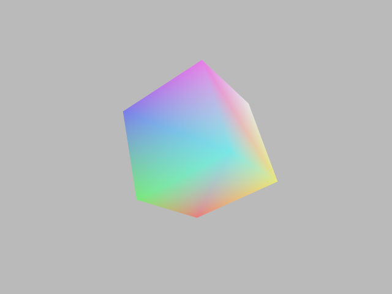
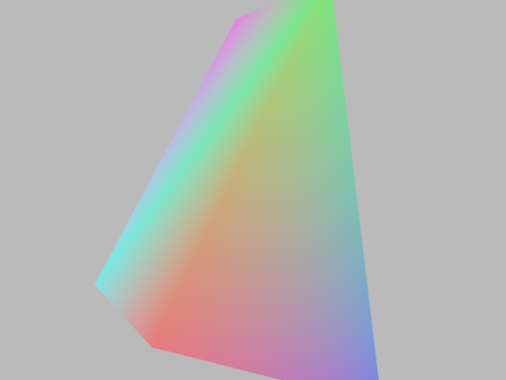
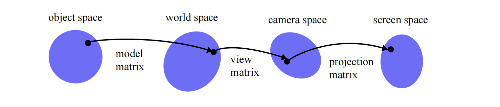
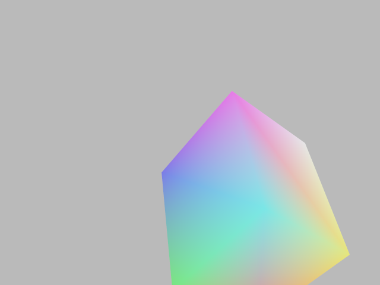
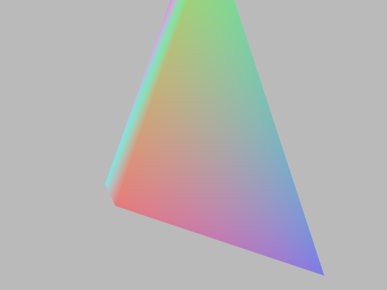
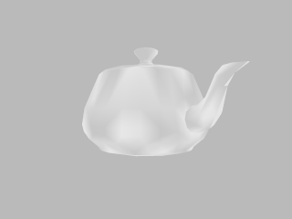

# Homework-2 README

## **Basic Tasks**

### **Homework 2.1 - Rendering a Single 3D Triangle**

In Homework 2.1, the task is to render a single 3D triangle. This involves projecting the 3D triangle onto a 2D image plane and rasterizing it. By leveraging concepts and methods from Homework 1, we build upon our existing framework to implement this functionality.

**1. Objective**
- Project a 3D triangle from camera space onto a 2D image plane located at `z = -1`.
- Render the projected triangle with anti-aliasing by using supersampling (4x4 grid per pixel).
- Clip triangles against the near clipping plane (`z_near`) and handle edge cases.

**2. Implementation**
- The implementation resides in the function `Image3 hw_2_1(const std::vector<std::string> &params)` within `hw2.cpp`. 

- The program takes several command-line arguments to define the properties of the triangle, view frustum, and rendering:
  - `-s`: Scaling factor for the view frustum.
  - `-p0`, `-p1`, `-p2`: Coordinates of the three vertices of the triangle.
  - `-color`: RGB color of the triangle.
  - `-znear`: Distance to the near clipping plane.

- The 3D vertices are transformed into camera space and then projected onto the 2D image plane at `z = -1`.
- Triangles are clipped against the near clipping plane to avoid rendering parts that are too close to the camera. This is achieved using the `ClipTriangleAgainstNearPlane` function.
- The projected 2D triangle is rasterized onto the image using a 4x4 supersampling grid for each pixel:
  - Each pixel is subdivided into 16 subpixels.
  - Subpixel coordinates are tested for inclusion within the triangle using `IsPointInsideTriangle`.
  - The final color of the pixel is averaged from the subpixel samples.

**3. Usage**
- Run the program with the following commands to test the triangle rendering:

   ```bash
   ./balboa -hw 2_1 -s 1 -po -1 0 -2 -p1 0 2 -4 -p2 1 -2 -5 -color 0.7 0.3 0.8 -znear 1e-6
   ./balboa -hw 2_1 -s 1 -po 2 2 -1 -p1 -1 -1 -2 -p2 2 0 -3 -color 0.3 0.8 0.2 -znear 1e-6
   ./balboa -hw 2_1 -s 1 -po 200 200 -100 -p1 1 3 -4 -p2 -2 -2 -2 -color 0.8 0.1 0.3 -znear 1e-6
   ```

**4. Outputs**
The rendered images can be viewed in:
- `outputs/hw_2_1_1.png`, a triangle with vertices forming a visible shape in the middle of the frame with a color close to purple.
- 
- `outputs/hw_2_1_2.png`, a green triangle at the bottom-right corner of the frame.
- 
- `outputs/hw_2_1_3.png`,a red triangle centered and scaled down due to the far projection.
- 

**5. Notes**
- Ensure the near clipping plane distance (`z_near`) is set appropriately to avoid artifacts.
- Verify anti-aliasing by zooming into the edges of the rendered triangles.
- Handle edge cases such as degenerate triangles (e.g., all vertices lying on a single line).

---
### **Homework 2.2 - Rendering a Single 3D Triangle**

This homework extends the rendering pipeline to handle triangle meshes, a common structure in computer graphics. Unlike a simple list of triangles, a triangle mesh efficiently shares vertices among triangles, reducing storage redundancy.

**1. Objective**
- Render triangle meshes using barycentric coordinates for depth interpolation.
- Implement depth buffering (Z-buffer) to correctly display triangles based on depth.

**2. Key Concepts**
- Triangle Mesh: A data structure that stores vertices, faces (triangles), and optional per-face and per-vertex colors.
- Barycentric Coordinates: Used to interpolate attributes like depth across the surface of a triangle.
- Depth Buffer (Z-buffer): Ensures that only the closest triangle to the camera is rendered for each pixel.

**3. Implementation Details**
- The implementation resides in the function `Image3 hw_2_3(const std::vector<std::string> &params)` within `hw2.cpp`.
- Parsing Input Parameters:
  - s: Scaling factor for the view frustum.
  - znear: Near clipping plane.
  - scene_id: Identifier for the scene to render.
- Processing Triangle Mesh:
  - Transform 3D world-space triangles into 2D image-space triangles.
  - Assign colors per triangle from face_colors.
- Depth Buffering:
  - For each pixel, determine if a projected triangle overlaps it.
  - Use barycentric coordinates to compute the depth value.
  - Update the Z-buffer and pixel color if the triangle is closer than the previous depth value.
- Supersampling:
  - Perform 4x4 sub-pixel sampling per pixel for smoother edges.

- Data Structure:
  ```cpp  
  struct TriangleMesh {
  std::vector<Vector3> vertices;     // 3D positions of the vertices
  std::vector<Vector3i> faces;       // Indices of the triangles
  std::vector<Vector3> face_colors;  // Per-face color of the mesh
  std::vector<Vector3> vertex_colors; // Per-vertex color of the mesh
  Matrix4x4 model_matrix;            // Transformation matrix
  };

**4. Usage**
- Run the program with the following commands to test the triangle meshes rendering:

   ```bash
  ./balboa -hw 2_2 -s 1.5 -znear 1e-6 -scene_id 1
  ./balboa -hw 2_2 -s 0.4 -znear 1e-6 -scene_id 2
  ./balboa -hw 2_2 -s 0.5 -znear 1e-6 -scene_id 3

   ```

**5. Outputs**
The rendered images can be viewed in:
- `outputs/hw_2_2_1.png`
- `outputs/hw_2_2_2.png`
- `outputs/hw_2_2_3.png`

---

### **Homework 2.3 - Perspective-Corrected Interpolation**

The objective is to implement perspective-corrected interpolation for vertex colors when rendering a triangle mesh. This technique ensures accurate color interpolation in 3D space by accounting for depth information. Unlike linear interpolation in screen space, perspective-corrected interpolation uses barycentric coordinates derived from the original 3D triangle geometry.

**1. Key Concepts**
- Vertex Color Interpolation: Vertex colors are specified for each triangle vertex. Colors are interpolated across the triangle surface using perspective-corrected barycentric coordinates.
- Perspective-Corrected Rendering: Avoids distortion caused by interpolating colors based on screen-space barycentric coordinates. Correctly computes the depth-adjusted interpolation using barycentric weights in 3D space.
- Scene Support: Multiple pre-defined scenes with varying mesh configurations. Rendered images are influenced by scaling factors and the near clipping plane distance.

**2. Implementation Details**
- The implementation resides in the function `Image3 hw_2_4(const std::vector<std::string> &params) ` within `hw2.cpp`.
- Barycentric Coordinate Calculation:
  Compute projected barycentric coordinates in image space.
  Transform these to original barycentric coordinates in 3D space for accurate depth calculations.
- Perspective-Corrected Interpolation:
  Interpolate vertex colors `C= b0C0+ b1C1+ b2C2`, using original barycentric coordinates `b0`,`b1`,`b2`.
- Z-Buffer Depth Testing:
  For each pixel, compare the interpolated depth with the Z-buffer value.
  Update the pixel color if the current triangle is closer.
- Key Functions:
  - `calculateProjectedBarycentricCoordinates`: Computes barycentric coordinates in image space.
  - `calculateOriginalBarycentricCoordinates`: Converts projected barycentric coordinates to 3D barycentric coordinates.
  - `calculateDepth`: Computes the interpolated depth for a given pixel using original barycentric coordinates.

**3. Usage**
- Run the program with the following commands to test the triangle meshes rendering:

   ```bash
  ./balboa -hw 2_3 -s 1.5 -znear 1e-6 -scene_id 1
  ./balboa -hw 2_3 -s 0.4 -znear 1e-6 -scene_id 2
  ./balboa -hw 2_3 -s 0.5 -znear 1e-6 -scene_id 3

   ```
**4. Outputs**
The rendered images can be viewed in:
- `outputs/hw_2_3_1.png`
- `outputs/hw_2_3_2.png`
- `outputs/hw_2_3_3.png`
---

### **Homework 2.4 - 3D Transformations**

In this assignment, we extend the 2D transformations from Homework 1 by implementing 3D transformations. These transformations include scaling, rotation, translation, and more advanced camera operations like `lookAt` and perspective transformations. The goal is to render 3D meshes in a scene with proper transformations applied.
**1. Key Concepts**
- Transformations:
  - **Scaling**: Objects can be scaled along the x, y, and z axes.
  - **Rotation**: Objects can be rotated about an arbitrary axis.
  - **Translation**: Objects can be translated in 3D space.
  - **LookAt Transformation**: This transformation aligns the camera to look at a specific target in the 3D scene, adjusting the camera's position, target, and up vector.
  - **Perspective Projection**: The projection matrix is applied to simulate the perspective effect on 3D objects as they move away from the camera.
- Camera Space:
  - The scene uses a camera space defined by the `cam_to_world` matrix in the `Camera` struct.
  - The `view matrix` is computed as the inverse of `cam_to_world`.
- Mesh Rendering:
  - Meshes are rendered after applying the transformations (model, view, and projection matrices) to project them onto the screen.
- Scene Format:
  - A scene is described using a JSON file containing the camera transformations, mesh data (in Stanford PLY format), and other properties.
  - The camera's transformation is described using a 4x4 transformation matrix, and the `lookAt` operation is applied to adjust the camera view.



**2. Implementation Details**
- The function `Image3 hw_2_4(const std::vector<std::string> &params)` in `hw2.cpp` implements the rendering logic. This function renders the scene described in the JSON file. It:
  - Parses the scene
  - Applies transformations to the vertices of the meshes using model, view, and projection matrices
  - Renders the scene into an image with proper depth buffering

- The function `Matrix4x4 parse_transformation(const json &node)` in `hw2_scenes.cpp` parses the transformation sequence from the JSON file and combines them into a single 4x4 transformation matrix. It supports:

  - **Scaling**: Constructs a scaling matrix.
  - **Rotation**: Constructs a rotation matrix around an arbitrary axis.
  - **Translation**: Constructs a translation matrix.
  - **LookAt**: Constructs a view matrix to orient the camera towards a specific target.

**3. Usage**
- To render a scene with transformations, use the following command:

   ```bash
  ./balboa -hw 2_4 ../scenes/cube.json
  ./balboa -hw 2_4 ../scenes/prism.json
  ./balboa -hw 2_4 ../scenes/teapot.json

   ```

**4. Outputs**
The rendered images can be viewed in:
- `outputs/hw_2_4_cube.png`
- `outputs/hw_2_4_prism.png`
- `outputs/hw_2_4_teapot.png`
---


***

## Bonus Challenges

### Homework 2.5 -- Design My Own Scene

For homework 2.5, I designed scenes located in `hw_2_5/shark1.json` as the **front view**, `hw_2_5/shark2.json` as the **top view**, `hw_2_5/shark3.json` as the **side view**.
- The 3D model `shark.ply` is downloaded from "https://people.sc.fsu.edu/~jburkardt/data/ply/ply.html"
- You can use the following command to generate the rendering:

   ```bash
  ./balboa -hw 2_4 ../scenes/hw2/shark1.json
  ./balboa -hw 2_4 ../scenes/hw2/shark2.json
  ./balboa -hw 2_4 ../scenes/hw2/shark3.json
  ```
- My renderings of the scenes can be found at
    - `hw_2_5/hw_2_5_front.png`, 
    - `hw_2_5/hw_2_5_top.png`,
    - `hw_2_5/hw_2_5_side.png`,

---
### Homework 2.1 Bonus--"Triangle Clipping"

Regarding homework 2.1's "Bonus: triangle clipping", The code you can find at the function `vector<Triangle3> ClipTriangleAgainstNearPlane(const Triangle3& inputTriangle)` in `code/src/hw2.cpp`.
- The code is 
  - `bonus_2_1/clip1.png`,
  - `bonus_2_1/clip2.png`,
  - `bonus_2_1/clip3.png`,
   
- If one vertex of a triangle is behind th near clipping plane: I use the following command:
   ```bash
  ./balboa -hw 2_1 -s 1 -p0 2 2 -4 -p1 1 0.3 -1 -p2 -2 -2 6 -color 0.8 0.1 0.3 -znear 1e-6
  ```
- and I generate the scene at `bonus_2_1/hw_2_1_1point.png`, 
- If two vertices of a triangle are behind th near clipping plane: I use the following command:
   ```bash
  ./balboa -hw 2_1 -s 1 -p0 2 2 4 -p1 1 0.3 1 -p2 -2 -2 -6 -color 0.8 0.1 0.3 -znear 1e-6
  ```
- and I generate the scene at `bonus_2_1/hw_2_1_2point.png`, 

---
### Homework 2.4 Bonus--"Generate an Animation by Interpolating between Transformations"
For homework 2.4's "Bonus: generate an animation by interpolating between transformations",
- I use `ffmpeg` to convert a sequence of images of the teapot (Rotate around the up axis, generate one image every 10 degrees of rotation, for a total of 360 degrees).
- The video file you can find in `bonus_2_4/output.mp4`.

---
### Homework 2.2 Bonus--"Occlusion Culling"

I didn't really implement this bonus, but I study that the idea is to create a MipMap for this image. Taking a 1024x1024 image as an example, 
MipMap-level 0 is the image itself. Level 1 combines every 4 pixels into one larger pixel, resulting in a lower-resolution 512x512 image. 
Level 2 continues this 4-to-1 operation based on the 512x512 image, and so on. When combining pixels, it is evident that in the HZBOC (Hierarchical Z-Buffer Occlusion Culling),
the depth of the four pixels with the highest depth value (the farthest from the viewpoint) is taken as the merged value. Assuming our Z-buffer has 4 levels, 
for the triangles that are about to be rendered, we first calculate their bounding box and take the depth value of the vertex with the smallest depth as the "depth."
Now, we determine a Mipmap Level, and the method to do so is to make the Mipmap level's pixel size as large as possible (the Mipmap level is as high as possible) 
while still meeting the following condition: the long edge of the bounding box must span at least two pixels. Iterate through each pixel inside this bounding box, find the maximum depth value, 
and if it is smaller than "depth," then the object is culled, and no further rendering is required. Otherwise, reduce the level and repeat the above test until the lowest level, level 0. 
If it still exceeds "depth," then the triangle needs to be rendered.