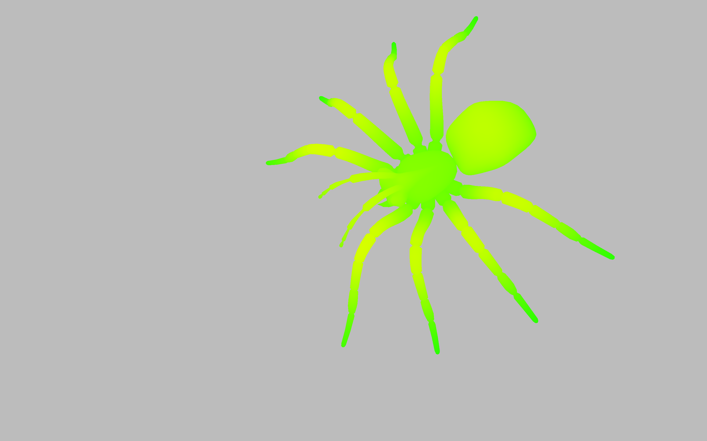

# Homework-3 README

## **Basic Tasks**

### **Homework 3.1 - Creating a Window with OpenGL**
For Homework 3.1, I created a simple OpenGL window and rendered a solid color background.
   - The code initializes GLFW, sets up an OpenGL context, and creates a window.
   - A background color is set and the window is rendered with the specified color.
   - The source code for this part can be found in `hw_3.cpp` file, particularly in the function `void hw_3_1(const std::vector<std::string> &params)`.
   - To test it using:
```bash
./balboa -hw 3_1
```
   - The result can be viewed in `outputs/hw_3_1.png`.
---
### **Homework 3.2 - Rendering a Rotating 2D Triangle**
For Homework 3.2, I rendered a rotating 2D triangle using OpenGL shaders and transformed the triangle in real-time based on time.
- The triangle's position and color are set using vertex buffers.
- A vertex shader handles the rotation of the triangle.
- The source code for this part can be found in `hw_3.cpp` file, particularly in the function `void hw_3_2(const std::vector<std::string> &params)`.
- To test it using:
```bash
./balboa -hw 3_2
```
- You can view the rendered scene in a video of the rotating triangle in 
  - `outputs/hw_3_2.mp4`
---
### **Homework 3.3 - Rendering 3D Triangle Meshes with Transformations**
For **Homework 3.3**, I implemented the rendering of multiple 3D triangle meshes within a scene, using various transformations such as **model**, **view**, and **projection** matrices. The task involved several key components:

**1. Setting Up the Scene**
- I parsed a scene description from a JSON file, which included camera settings, background color, and 3D mesh data (vertices, faces, colors, UV coordinates, and normals).
- I used the **tinyply** library to load mesh data from **PLY** files, extracting vertex positions, face indices, vertex colors, UVs, and normals (if available).

**2. Model, View, and Projection Matrices**
- The scene was set up with a **projection matrix**, which maps 3D coordinates to 2D screen space. This matrix was calculated based on the camera's field of view and near/ far clipping planes.
- I also implemented a **view matrix**, using the camera's **camera-to-world** transformation, to simulate a camera's position and orientation within the scene.
- Each mesh in the scene was rendered with a **model matrix**, which applied transformations such as translation, rotation, and scaling to position the meshes correctly in the world space(in `hw3_scenes.cpp`).

**3. Camera Interaction**
- Keyboard controls were implemented to interact with the camera. Using **WASD** for movement and the mouse for rotation, the user can control the camera's position and orientation to explore the scene.

**4. Rendering Process**
- I used **OpenGL** to render the meshes in the scene. Each mesh's transformation (using the model matrix) was applied before rendering.
- A vertex shader handled the mesh rotation, and a fragment shader was responsible for rendering each pixel of the scene.
- The **depth test** and **framebuffer sRGB** were enabled to handle proper rendering order and color accuracy.

**5. Run and Test the Rendering**
- To test the OpenGL rendering, use the following commands:

```bash
./balboa -hw 3_3 ../scenes/hw3/two_shapes.json
./balboa -hw 3_3 ../scenes/hw3/cube.json
./balboa -hw 3_3 ../scenes/hw3/spheres.json
./balboa -hw 3_3 ../scenes/hw3/teapot.json
./balboa -hw 3_3 ../scenes/hw3/bunny.json
./balboa -hw 3_3 ../scenes/hw3/buddha.json
```
**6. Output**
- The rendered scenes, including transformed meshes and interactive camera movements, were captured in images and videos. The video files for each scene are saved as:
   - `outputs/hw_3_3_two_shapes.mp4`
   - `outputs/hw_3_3_cube.mp4`
   - `outputs/hw_3_3_spheres.mp4` 
   - `outputs/hw_3_3_teapot.mp4`
   - `outputs/hw_3_3_bunny.mp4`
   - `outputs/hw_3_3_buddha.mp4`

- The source code for this part can be found in the following files:
   - `hw3.cpp`,particularly in the function `void hw_3_3(const std::vector<std::string> &params)`
   - `hw3_scenes.cpp`
   - `hw3_scenes.h`
---
### **Homework 3.4 - Implementing Basic Lighting**

For **Homework 3.4**, I implemented basic lighting effects in the OpenGL renderer, enhancing the visual quality of the rendered scenes by applying ambient and specular lighting. This task required the following key components:

**1. Setting Up the Scene**
- I parsed the scene description from a JSON file, which included camera settings, background color, and 3D mesh data (vertices, faces, colors, UV coordinates, and vertex normals).
- Vertex normals were used to calculate accurate lighting for each vertex in the scene, as they are essential for achieving smooth shading effects.

**2. Lighting Implementation**
- I implemented a basic Phong lighting model using the following parameters:
  - **Ambient Strength**: `0.1`
  - **Specular Strength**: `0.5`
  - **Light Direction**: `normalize(vec3(1, 1, 1))`
  - **Light Color**: `vec3(1.0, 1.0, 1.0)`
  - **Camera Position**: Extracted from the fourth column of the `camera-to-world` matrix.
- The vertex colors or texture colors were used as the **objectColor** in the lighting calculations.

**3. Transformation Matrices**
- I used the following matrices to render the scene with proper transformations:
  - **Projection Matrix**: Transformed 3D coordinates to 2D screen space, based on the camera's field of view and aspect ratio.
  - **View Matrix**: Simulated the camera's position and orientation in the scene.
  - **Model Matrix**: Applied transformations (translation, rotation, scaling) to each 3D mesh.

**4. Rendering Process**
- Lighting calculations, including ambient, diffuse, and specular components, were implemented in the fragment shader.
- The following OpenGL settings were used to ensure correct rendering:
  - **Depth Test**: Enabled to handle hidden surface removal.
  - **Framebuffer sRGB**: Enabled to maintain accurate color rendering.
- Each mesh was rendered with its corresponding transformation matrices and lighting effects applied.

**5. Run and Test the Lighting**
- To test the OpenGL rendering with basic lighting, use the following commands:

```bash
./balboa -hw 3_4 ../scenes/hw3/spheres.json
./balboa -hw 3_4 ../scenes/hw3/teapot.json
./balboa -hw 3_4 ../scenes/hw3/bunny.json
./balboa -hw 3_4 ../scenes/hw3/buddha.json
```
**6. Output**
- The rendered scenes, including basic lighting effects, were captured in screenshots. The output files are saved as:
  - `outputs/hw_3_4_spheres.png`,
  - `outputs/hw_3_4_teapot.png`,
  - `outputs/hw_3_4_bunny.png`,
  - `outputs/hw_3_4_buddha.png`,

---
### Homework 3.5 -Design My Own Scenes and Render It Using My New Renderer

For homework 3.5, I designed scenes located in `hw_3_5/balance.json`, `hw_3_5/spider.json`.
   The 3D model `balance.ply` and `big_spider.ply` is downloaded from "https://people.sc.fsu.edu/~jburkardt/data/ply/ply.html"
- However, the RGB color values in the ply file were added by myself using code.
- My renderings of the scenes can be found at `hw_3_5/balance.png`,
- and `hw_3_5/spider.png`, 
- the video file can be found at:
  - `hw_3_5/spider.mp4`
- To generate the rendering, you can use: 
```bash
./balboa -hw 3_3 ../scenes/hw3/balance.json 
./balboa -hw 3_3 ../scenes/hw3/spider.json
```

---
***

## Bonus Challenges

### Homework 3.3 Bonus--"Camera Rotation Based on Mouse"

Regarding homework 3.3's "Bonus: Camera interaction", I implemented mouse-based camera control for rotating the camera view. The user can click and drag the mouse to rotate the camera and explore the 3D scene.
- The code you can find at `* camera_mouse` in the function `void hw_3_3(const std::vector<std::string> &params)` in `hw3.cpp`.
   The code is `bonus3_3_camera_rotation_based_on_mouse/code1.png`,`bonus3_3_camera_rotation_based_on_mouse/code2.png`,
   `bonus3_3_camera_rotation_based_on_mouse/code3.png`,
   
- My recordings of the renderings can be found at 
  - `bonus3_3_camera_rotation_based_on_mouse/camera_rotation_based_on_mouse.mp4`
  - `bonus3_3_camera_rotation_based_on_mouse/camera_rotation_based_on_mouse2.mp4`
  - `bonus3_3_camera_rotation_based_on_mouse/camera_rotation_based_on_mouse3.mp4`


---
### Homework 3.3 Bonus--"Texture"

Regarding homework 3.3's "Bonus: Textures", I added texture mapping to the meshes. Textures were applied using UV coordinates, and different 3D objects (e.g., Buddha, Bunny) were rendered with textures.
- The code you can find at `//  ！！！texture` in the function `void hw_3_3(const std::vector<std::string> &params)` in `hw3.cpp`.
- where I designed the structure `MeshOpenGLData` includes `unsigned int vboUV` and `unsigned int textureID`. The main code is `bonus3_3_texture/code.png`,
- My renderings can be found at `bonus3_3_texture/texture_buddha.png`,
  `bonus3_3_texture/texture_bunny.png`, 
  `bonus3_3_texture/texture_teapot.png`, 
  and `bonus3_3_texture/texture_spheres.png`,  which uses texture downloaded from the
  website `bonus3_3_texture/spheres.jpg`, 

---
### Homework 3.4 Bonus--"Lighting Animation"

Regarding homework 3.4's "Bonus: Lighting Animation", I implemented an animation for the lighting in the scene. The light source moves in a dynamic way, which can be customized and visualized in the rendered scene.

- The code you can find at `/* with animation` before the function `void hw_3_4(const std::vector<std::string> &params)` in `hw3.cpp`.
- The main code is `bonus3_4/code1.png`,
- Video files can be found at 
   - `bonus3_4/lightning_animation1.mp4`
   - `bonus3_4/lightning_animation2.mp4`

---
### Homework 3.4 Bonus--"Different Types of Lights"

Regarding homework 3.4's "Bonus: Different Types of Lights", in addition to the default directional light, I implemented **point lights** and **spot lights** in the renderer.
- **Point lights** emit light from a single point in all directions. **Spot lights** emit light in a specific direction, creating a cone of light with a defined angle.
Multiple lights of different types can be added to the scene, creating more complex lighting effects.

- The code you can find at ` * different type of lights` before the function `void hw_3_4(const std::vector<std::string> &params)` in `hw3.cpp`.
- The main code is `bonus3_4/code2.png`, `bonus3_4/code3.png`, 
- My renderings can be found at `bonus3_4/different_types_lights_1.png`,
  `bonus3_4/different_types_lights_2.png`, 
