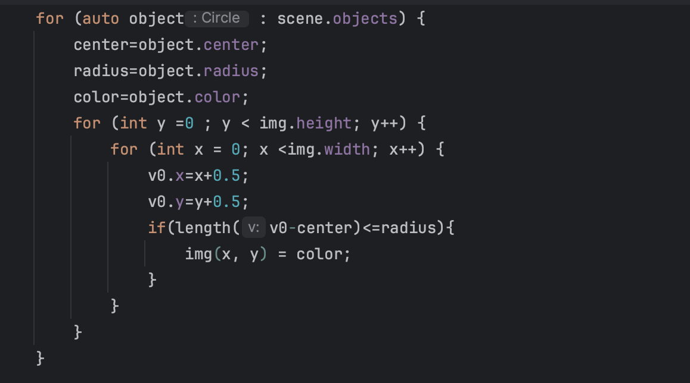
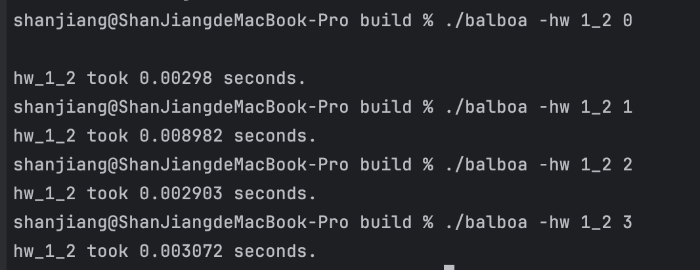
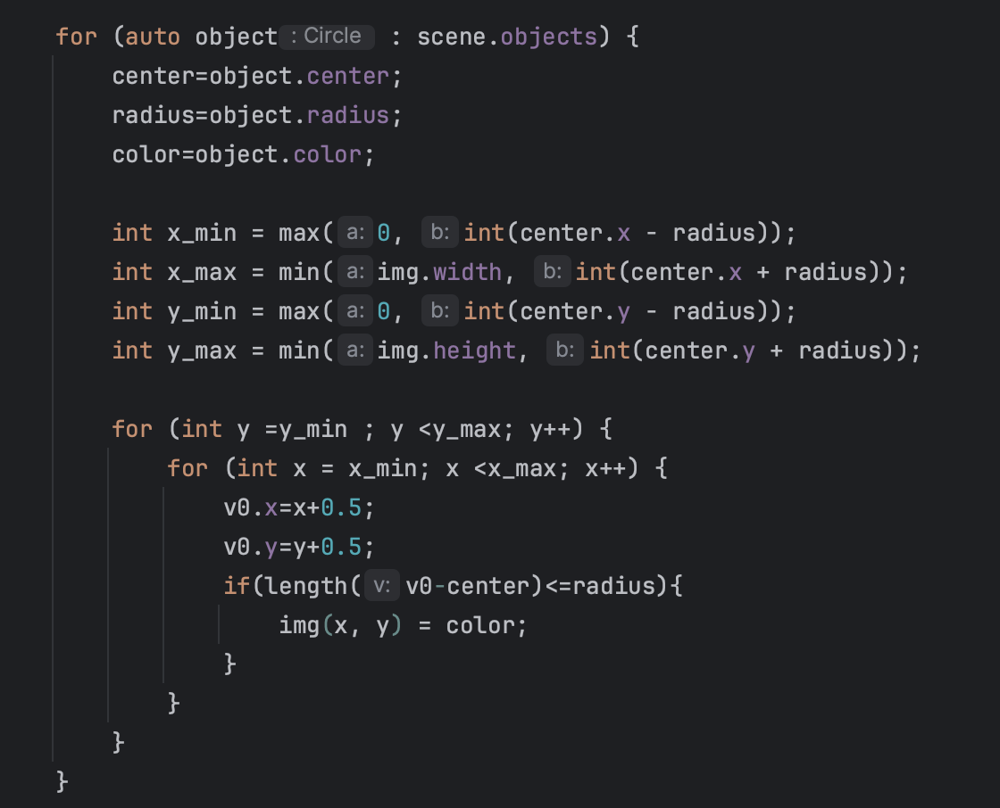
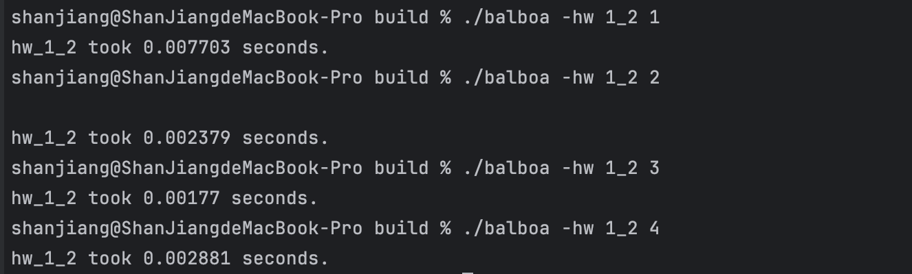
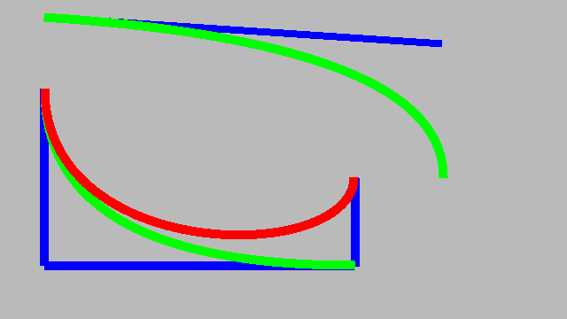

# Homework Submission README

## Homework 1.7

1. For homework 1.7, I designed scenes located in "homework_1_7/miffy.json".
    - My rendering of the scene can be found at "homework_1_7/hw_1_7_miffy.png". 
    - You can use "./balboa -hw 1_5 ../scenes/hw1/miffy.json" to generate the rendering

## Homework 1.2 Bonus

1. Regarding homework 1.2's "Bonus (15 pts): accelerating rasterization using bounding boxes,"
   My original code was as follows:
    - 
    - [Original Code without Bounding Boxes](code/src/hw1.cpp)
    - Its runtime was as follows: 

   After implementing bounding boxes, I improved the code as follows:
   - 
    - [Improved Code with Bounding Boxes](code/src/hw1.cpp)
    - Its runtime has been reduced to the following: 
    - From the before-and-after comparison, it is evident that using bounding boxes to accelerate the rasterization process can yield a significant performance boost of several times.

## Homework 1.8 Bonus

1. For homework 1.8's "Bonus: line and Bézier curve rendering (15 pts)," 
    - I made modifications to the code in `src/hw1.cpp`,`src/hw1.h`,`src/hw1_scenes.cpp`,`src/hw1_scenes.h` and `src/main.cpp` to enable the function "Image3 hw_1_8(const std::vector<std::string> &params);". 
    - I created a scene located at "homework_1_8/line.json," and the generated image can be found at "homework_1_8/hw_1_8.png". 
    - You can use "./balboa -hw 1_8 ../scenes/hw1/line.json" to generate the rendering

