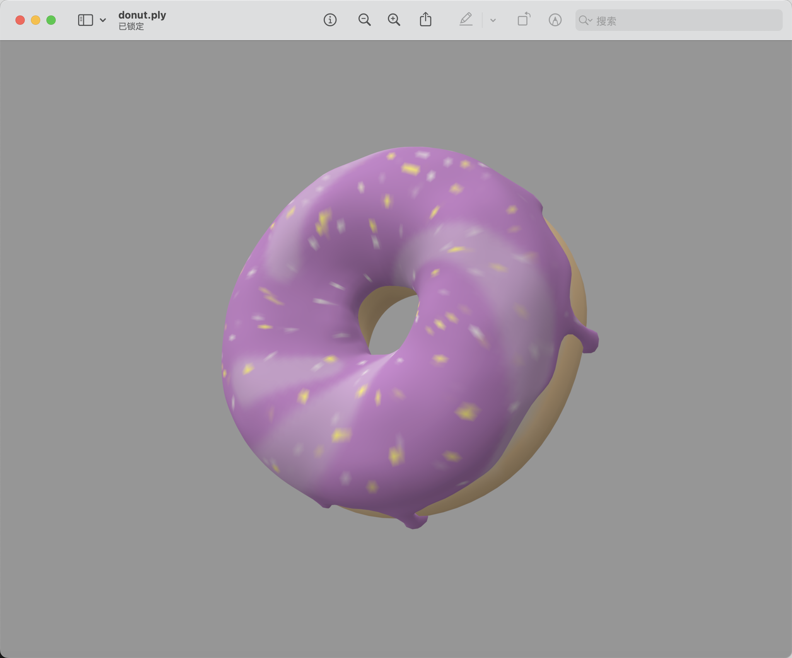
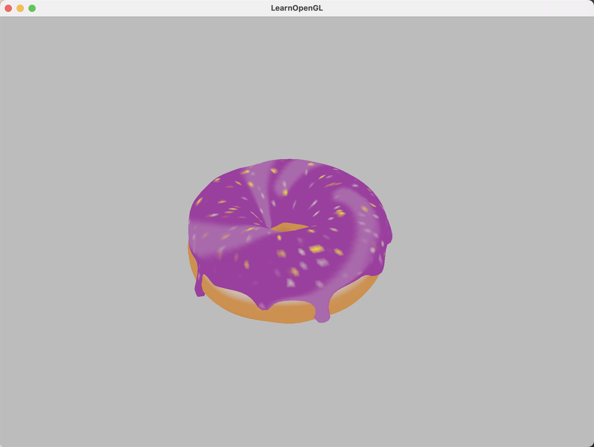
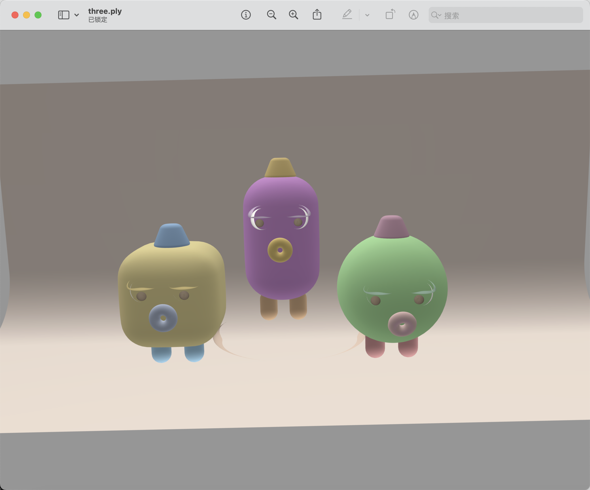
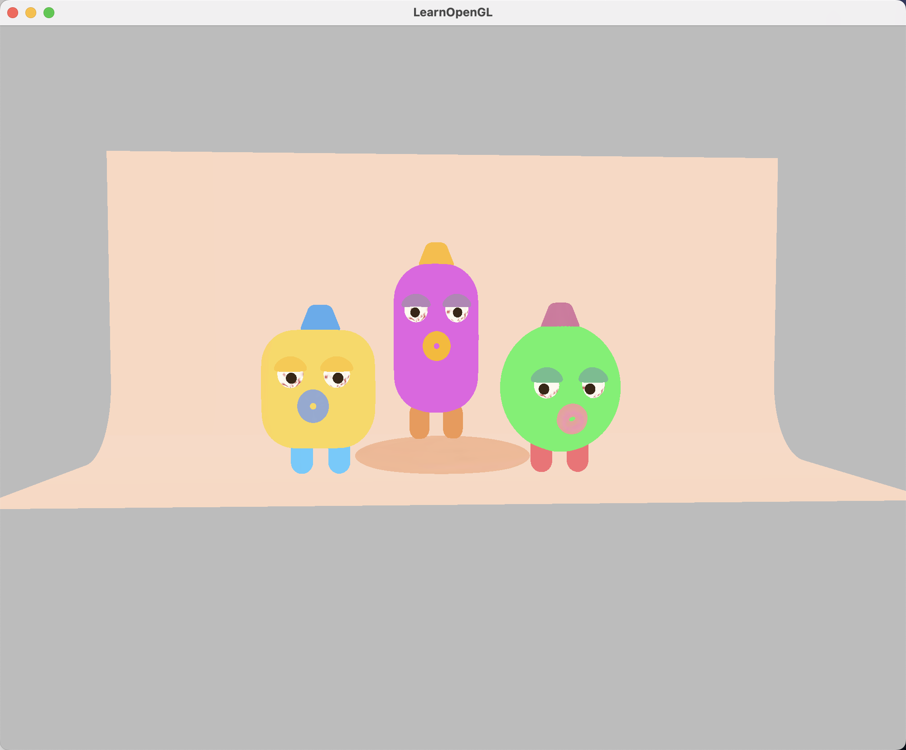
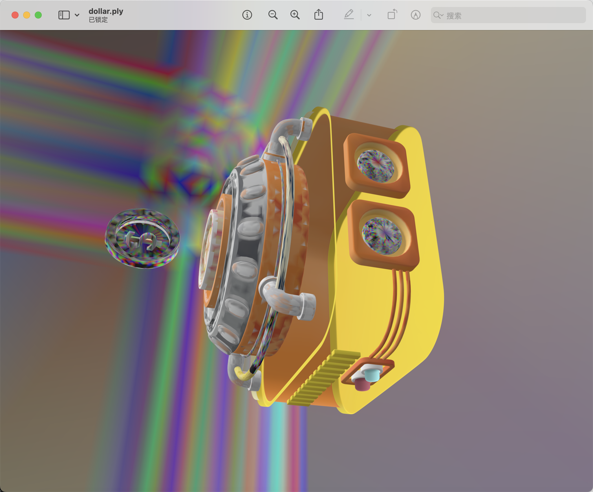
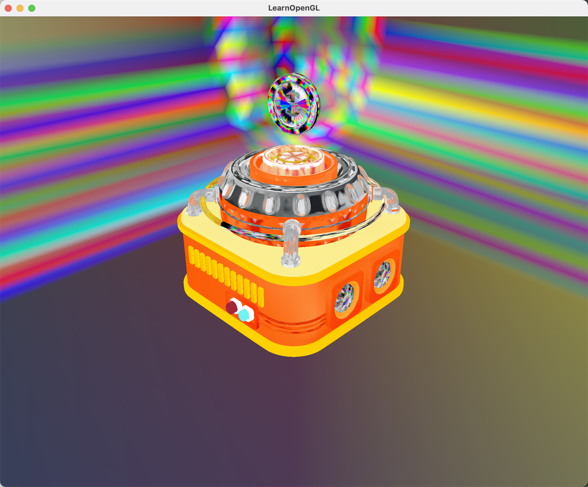
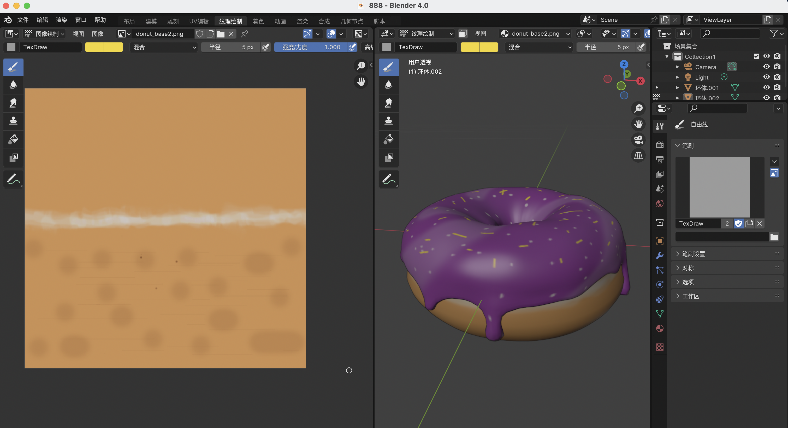
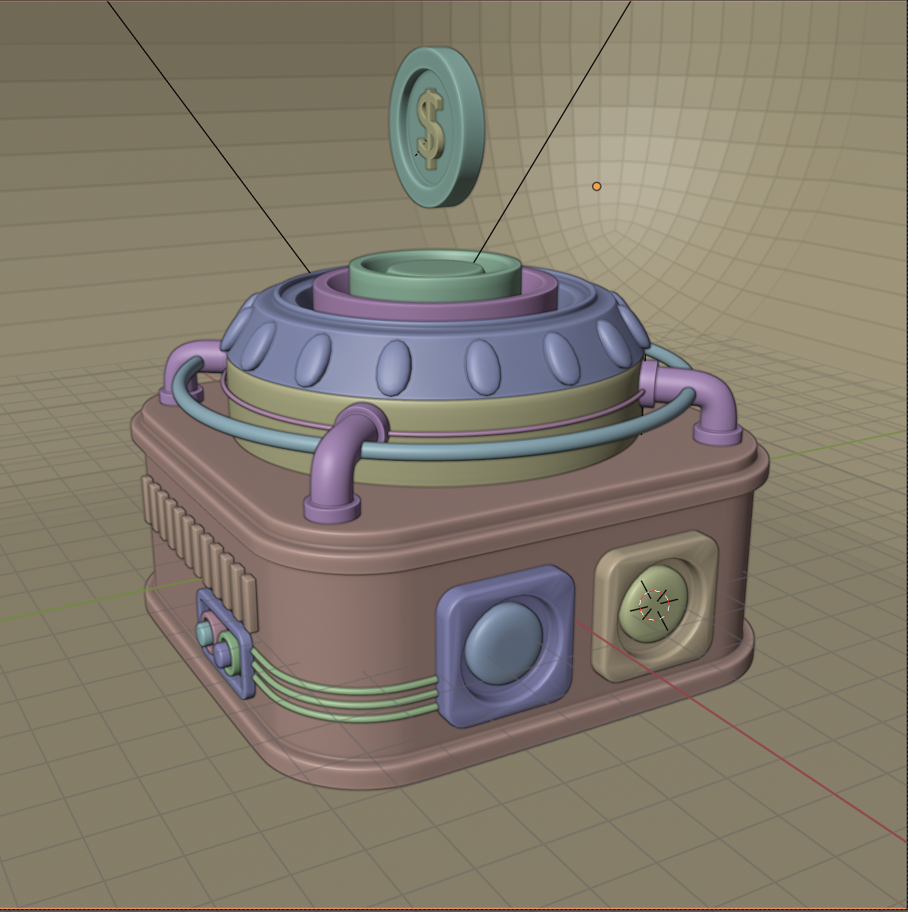
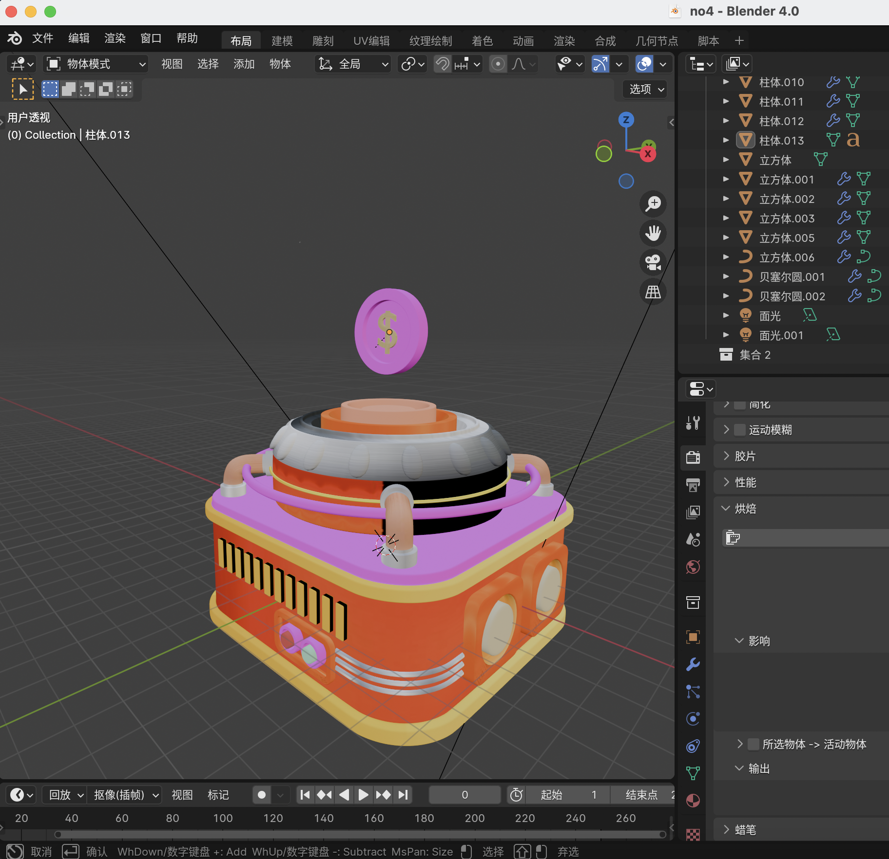
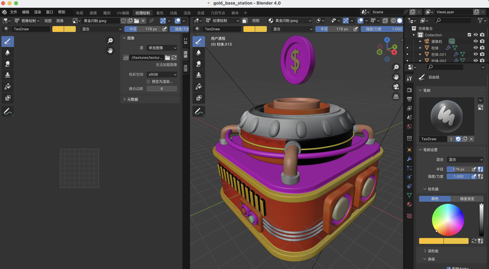

# Blender Project

This project showcases my 3D modeling and rendering work created using Blender. Below you can find details about the files included and instructions on how to explore or use the project.

---

## Project Overview
- **Tool Used**: Blender
- **File Types**: `.blend`, `.ply`, `.json`, `.png`
- **Key Features**:
  - [Describe features, e.g., high-poly modeling, custom textures, procedural shading, etc.]

---

## How to Use

1. **Open the Blender File**:
   - Use Blender (version 4.0 or higher) to open `blenders/project.blend`.

2. **Import 3D Models**:
   - Import `.ply` or `.json` files using:
     - `.ply`: File > Import > PLY
     - `.json`: Use a compatible plugin or script.

3. **View Renders**:
   - Check the rendered images in the `outputs/renders/` folder.

---

## Previews

### .ply File of Donut

### Render of Donut

### .ply File of Three Boys

### Render of Three Boys

### .ply File of Gold Base Station

### Render of Gold Base Station

### Screenshots of Blender
The following shows some screenshots of the interface working in blender:

